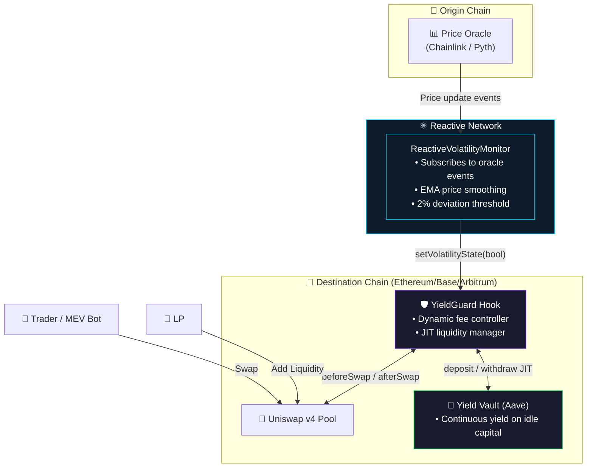
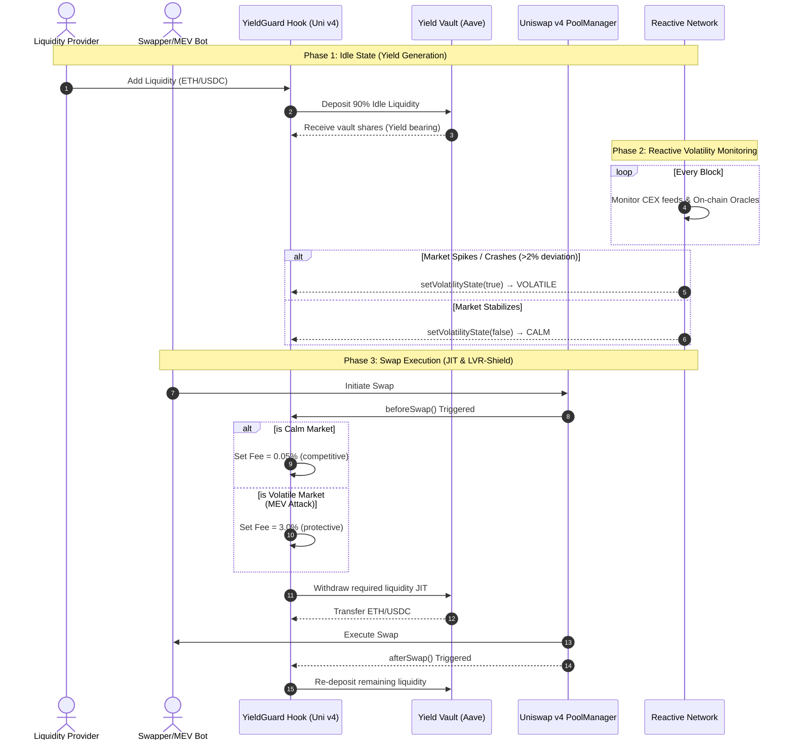

# 🛡️ YieldGuard — Sustainable Liquidity & MEV Protection

> A Uniswap v4 Hook that combines **Capital Efficiency** (Lending Yield) with **MEV Protection** (Dynamic Volatility Fees), orchestrated entirely by the **Reactive Network**.

[](https://hookathon.uniswap.org)
[](https://reactive.network)
[](https://book.getfoundry.sh)

---

## 📖 Table of Contents

- [The Problem](#-the-problem)
- [The Solution](#-the-solution)
- [System Architecture](#-system-architecture)
- [How It Works](#-how-it-works)
- [Reactive Network Integration](#-reactive-network-integration)
- [Smart Contracts](#-smart-contracts)
- [Getting Started](#-getting-started)
- [Test Coverage](#-test-coverage)
- [Video Pitch Script](#-video-pitch-script)

---

## 🔴 The Problem

In volatile AMM pairs, Liquidity Providers (LPs) face two compounding issues that make providing liquidity unsustainable:

### 1. Loss Versus Rebalancing (LVR) / MEV Extraction
MEV searchers and arbitrageurs extract value from LPs by trading against stale AMM prices when external markets (CEXes like Binance) suddenly crash or spike. This is commonly known as **toxic arbitrage** — the LP is always on the wrong side of the trade.

### 2. Idle Capital
When swap volume is low, LP capital sits idle in the pool earning minimal fees. If fees are kept low to attract volume, LPs don't make enough yield to offset their impermanent loss risk.

**Result:** LPs lose money in volatile pairs and withdraw, reducing liquidity depth, which hurts the entire Uniswap ecosystem.

---

## 💡 The Solution

**YieldGuard** solves both problems simultaneously using the **Reactive Network** as an intelligent off-chain orchestrator:

| Feature | Mechanism | Benefit |
|---------|-----------|---------|
| 🏦 **Yield Generation** | 90% of idle LP capital is routed to a lending protocol (Aave) | LPs earn continuous base yield even during low-volume periods |
| 🛡️ **LVR-Shield** | Reactive Network monitors price feeds and dynamically spikes the swap fee to 3.0% during volatility | Toxic MEV arbitrageurs are taxed, protecting LP capital |
| ⚡ **JIT Execution** | Liquidity is pulled from Aave just-in-time for swaps, then re-deposited | Capital is never idle — always earning yield or facilitating swaps |
| 🔄 **Competitive Fees** | During calm markets, fees drop to 0.05% | Attracts organic swap volume when MEV risk is low |

---

## 🏗️ System Architecture



---

## ⚙️ How It Works

### Phase 1: Idle State — Yield Generation
```
LP deposits capital → YieldGuard Hook → 90% routed to Aave → Continuous yield accrual
```
When trading volume is low, capital shouldn't sit idle. After an LP adds liquidity, the `afterAddLiquidity` hook automatically deposits 90% of the assets into the yield vault (Aave mock), earning continuous lending yield.

### Phase 2: Reactive Monitoring — The LVR-Shield
```
Oracle price update → Reactive Network detects deviation → Triggers setVolatilityState()
```
The `ReactiveVolatilityMonitor` contract on the Reactive Network continuously monitors oracle price feeds. It uses an **Exponential Moving Average (EMA)** to smooth out noise and only triggers a state change when the deviation exceeds **2%** (200 bps).

| Market State | Fee | Purpose |
|-------------|-----|---------|
| 😌 **CALM** | 0.05% (500 bps) | Attract organic volume with competitive fees |
| 🔥 **VOLATILE** | 3.0% (30,000 bps) | Tax toxic MEV arbitrage, protect LPs |

### Phase 3: JIT Swap Execution
```
Swap initiated → beforeSwap: set dynamic fee + pull liquidity from vault → Execute swap → afterSwap: re-deposit to vault
```



---

## ⚛️ Reactive Network Integration

### Why Reactive Network?

Traditional approaches to MEV protection require centralized keepers or off-chain bots. **Reactive Network** provides a decentralized, trustless alternative:

1. **Event-Driven:** Reactive Smart Contracts (RSCs) automatically subscribe to on-chain events — no keeper infrastructure needed.
2. **Cross-Chain:** The RSC on Reactive Network monitors Oracle events on Chain A and triggers callbacks on Chain B.
3. **Trustless:** All logic runs in Solidity smart contracts, verifiable and immutable.

### Our RSC: `ReactiveVolatilityMonitor`

```
Oracle Event (price update) 
    → RSC receives event via react()
    → Calculates price deviation (EMA-smoothed)
    → If deviation > 2%: emit Callback → setVolatilityState(true)
    → If deviation < 2%: emit Callback → setVolatilityState(false)
```

**Key Features:**
- **EMA Smoothing:** `newRef = (oldRef × 9 + currentPrice) / 10` — prevents false triggers from single-block noise.
- **Rate Limiting:** Minimum 12-second interval between state updates to prevent reactive spam.
- **Bidirectional Detection:** Catches both upward spikes AND downward crashes.

---

## 📦 Smart Contracts

| Contract | Path | Description |
|----------|------|-------------|
| `YieldGuard` | `src/YieldGuard.sol` | Main Uniswap v4 Hook — dynamic fees + JIT yield routing |
| `MockYieldVault` | `src/mocks/MockYieldVault.sol` | ERC4626-like vault simulating Aave for testing |
| `ReactiveVolatilityMonitor` | `src/reactive/ReactiveVolatilityMonitor.sol` | Reactive Network RSC for volatility detection |

### Hook Permissions

```solidity
beforeSwap:    ✅  // Set dynamic fee + JIT pull from vault
afterSwap:     ✅  // Re-deposit excess to vault  
afterAddLiquidity:    ✅  // Route idle capital to vault
beforeRemoveLiquidity: ✅  // Pull capital from vault before removal
```

---

## 🚀 Getting Started

### Prerequisites
- [Foundry](https://book.getfoundry.sh/getting-started/installation) installed
- Git

### Setup
```bash
git clone <this-repo>
cd v4-template
git submodule update --init --recursive
```

### Build
```bash
forge build
```

### Test
```bash
forge test -vvv
```

### Run Specific Tests
```bash
# Happy path tests
forge test --match-test "test_SwapInCalmState" -vvv

# Failure/revert tests
forge test --match-test "test_RevertWhen" -vvv

# Fuzz tests
forge test --match-test "testFuzz" -vvv

# Reactive Network tests
forge test --match-test "test_ReactiveMonitor" -vvv
```

---

## 🧪 Test Coverage

Our test suite follows the **"Test Early, Test Often"** philosophy with comprehensive coverage:

### ✅ Success Flows (Happy Path)
| Test | What it verifies |
|------|-----------------|
| `test_InitialState` | Hook initializes in CALM mode with correct constants |
| `test_SetVolatilityState_Volatile` | Reactive relayer can set VOLATILE state |
| `test_SetVolatilityState_CalmAfterVolatile` | State can toggle back to CALM |
| `test_SwapInCalmState_LowFee` | Swaps execute with 0.05% fee in CALM |
| `test_SwapInVolatileState_HighFee` | Swaps execute with 3.0% fee in VOLATILE |
| `test_VolatileFeeHigherThanCalm` | Proves volatile fee results in less output |

### ❌ Failure Flows (Reverts & Access Control)
| Test | What it verifies |
|------|-----------------|
| `test_RevertWhen_UnauthorizedSetsVolatility` | Non-relayer cannot update state |
| `test_RevertWhen_RandomEOASetsVolatility` | Random addresses are blocked |
| `test_RevertWhen_HookSelfCallsVolatility` | Even the hook itself is blocked |

### ⚛️ Reactive Network Tests
| Test | What it verifies |
|------|-----------------|
| `test_ReactiveMonitor_InitialState` | RSC initializes correctly |
| `test_ReactiveMonitor_DetectsVolatility` | 5% spike detected (above 2% threshold) |
| `test_ReactiveMonitor_DetectsCrash` | 3% crash detected |
| `test_ReactiveMonitor_ReactEmitsCallback` | `react()` emits correct Callback event |
| `test_ReactiveMonitor_EMAUpdate` | Reference price updates via EMA |

### 🎲 Fuzz Tests
| Test | What it verifies |
|------|-----------------|
| `testFuzz_SwapInCalmState` | Random amounts (0.001-10 ETH) never revert in CALM |
| `testFuzz_SwapInVolatileState` | Random amounts never revert in VOLATILE |
| `testFuzz_ReactiveMonitor_DeviationCalculation` | Math is correct for random price pairs |
| `testFuzz_UnauthorizedCannotSetVolatility` | No random address can bypass access control |

---


## 📄 License

MIT
